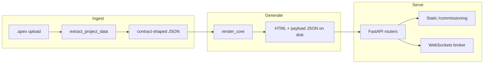

# Architecture Investigation — Sentinel (AI reference)

**Doc status:** Filled from `bootstrap.md`, `codebase_map.md`, and targeted repo reads (`pyproject.toml`, `src/sentinel/server/app/main.py`, `generation/render_core.py`, `server/api/testing.py`, `server/services/pipeline.py`, `ui/commissioning/*.js` grep). **Not** profiled in browser or under load.

## Bootstrap / codebase_map freshness (spot-check)

| Claim | Result |
|--------|--------|
| Read-first: `docs/diagrams/sentinel_system_context.mmd`, `sentinel_inprocess_architecture.mmd` | Present |
| `docs/directives/dev_environment_and_workflow.md`, `AGENTS.md` | Present |
| Optional `codebase_map.md` index | Matches tree: `src/sentinel/{contracts,extraction,generation,server,ui}`, `dev_tests/{regression,ui}`, `devtools/render_*_pdf.py`, `.github/workflows/ci.yml` |
| `pyproject.toml` deps: FastAPI, Uvicorn, Pydantic, pg8000 | Confirmed in `[project] dependencies` |
| `main.py`: Trace + commissioning auth middleware, `/health`, `/commissioning` StaticFiles, routers commissioning/events/testing | Confirmed |
| Migrations: two `002_*.sql` (fail tags + idempotency) | Confirmed (`001`–`006` total) |
| CI: `pip install -e ".[dev]"`, `unittest` discover `dev_tests/regression` | Confirmed; **UI Playwright not in this workflow file** |

---

## 1. Data source & structure

- **Inputs:** Uploaded **`.apex`** project archives → **extraction** produces **JSON** shaped by `contracts/apex_project_structure_v4.json` (devices, events, pages, etc.). UI layout for generation uses `contracts/app_ui_structure.json`.
- **Runtime load paths:** **Local filesystem** — `SENTINEL_UPLOAD_ROOT` / `SENTINEL_GENERATED_ROOT` (defaults `uploads/`, `generated/`) via `server/services/pipeline.py`; DB via **`DATABASE_URL`** → **PostgreSQL** (`pg8000`) or **`InMemoryRepository`** if unset.
- **Not** CDN/object-store for core flow; operator browser loads **HTTP** from FastAPI (+ nginx on droplet per directive).
- **Static vs dynamic:** Generated HTML/JSON are **materialized artifacts** after extract/generate; **not** rebuilt per HTTP request. Commissioning/testing UIs are **packaged static assets** under `sentinel/ui/**` (see `pyproject.toml` `package-data`).
- **Schema:** **Normalized by contract** (Pydantic validation on POST bodies; extraction validates extracted shape). Depth: nested devices/pages/buttons; relational links resolved in extraction (`resolvedPageLink`, etc.).

---

## 2. Rendering model

- **Strategy:** **Hybrid**
  - **Offline/static generation:** CLI / pipeline runs extraction + **`generation/render_core.py`** → writes **HTML + JSON payload files** (technician runtime).
  - **CSR** for **commissioning console** and **testing shell**: browser executes packaged `.js`; **no SSR** for those SPAs.
  - FastAPI returns **`FileResponse` / `HTMLResponse`** for technician routes (static file serving), not Jinja SSR for app pages.
- **Injection patterns:** `render_core.py` builds HTML via **Python string assembly** + **`html.escape`** for text; embeds **JS/CSS** from files (`read_text`). Commissioning JS uses **`innerHTML` / `insertAdjacentHTML`** for DOM updates (see §10).
- **Templating:** **No** Jinja/React/Vue. Generation is **imperative Python** + JSON contracts; console is **vanilla JS** modules.

---

## 3. Frontend architecture

- **Framework:** **None** (vanilla JS + static HTML/CSS).
- **Structure:** Split by concern (`commissioning.js`, `commission_tab.js`, `diagnostics_tab.js`); some shared helpers; **duplication risk** across tabs is moderate (separate large files).
- **State:** **Scattered** module-level and DOM-backed state; WebSocket + REST for server truth (commissioning project WS, testing endpoints).
- **Anti-patterns observed:** **Direct DOM manipulation** is the primary model (by design). Data/render mixed in large tab scripts.

---

## 4. Styling system

- **Approach:** **External CSS** (`sentinel_console.css`, tab CSS) + **embedded theme** for device/testing (`sentinel_device_theme.css` inlined in generation path).
- **Design system:** **No** formal design-system package; **convention** via shared CSS files and repeated class strings in JS.
- **JS style injection:** Generated pages inject **read CSS/JS blobs** from disk into HTML strings (generation), not CSS-in-JS.

---

## 5. Backend / delivery layer

- **Stack:** **FastAPI** + **Uvicorn**; optional **nginx** reverse proxy (droplet).
- **Roles:** **API** (commissioning, testing, events) + **static file server** for commissioning UI and generated artifacts + **WebSockets** (project events, testing).
- **Server-side templating:** **No** (except string-built HTML in **offline** generator).

---

## 6. Device UI model

- **Generation:** **Schema- and contract-driven** from extracted JSON (`render_core.py` maps buttons, pages, targets, graphics).
- **Runtime technician UI:** **Static HTML** per device page + **embedded** test-status script/theme; behavior driven by **payload JSON** and packaged JS.
- **Primitives:** Buttons/pages/targets derived from extraction model; shared rendering logic centralized in **`render_core.py`** (large module → **high cohesion, large blast radius**).
- **Duplication:** Layout variants may duplicate patterns inside `render_core.py` (single-file size suggests copy-paste sections possible — refactor would need careful tests).

---

## 7. Dashboard behavior

- **Commissioning console:** **Manage / commission / diagnostics** tabs; **monitoring** (progress, rollups, fail tags) + **control** (uploads, regenerate) + **diagnostics** (notes, task bodies).
- **Data flow:** **HTTP REST** under `/api/v1/commissioning/...` + **WebSocket** project channel (`commissioning_project_ws`); broker **`ProjectEventBroker`** with replay.
- **Testing router:** **WebSockets** + HTTP POST results; **debounced** commissioning rollup refresh pushed over WS after technician posts (`commissioning_rollups` events).
- **Reactivity:** Client-driven refresh + WS pushes; not a reactive framework store.

---

## 8. Performance analysis

- **Measured:** **None** in this pass (no Lighthouse, no load tests, no timings).
- **Likely bottlenecks (architectural):**
  - **Large `render_core.py`** → CPU/memory during **generate**; **monolithic** Python string building.
  - **WS + debounced rollups** → burst POSTs coalesce; still **DB + aggregation** on refresh.
  - **Generated HTML size** (embedded assets) → **payload/parse** cost on technician tablets/browsers.
  - **Commissioning tabs:** heavy **DOM churn** via `innerHTML` on updates.

---

## 9. Deployment & versioning

- **Pipeline:** Commit → **`git archive ... HEAD src`** → zip → **`scp`/extract** on droplet → **`deployment/verify_deploy_hash.py`** / on-disk checks → **systemd** restart (see `docs/directives/dev_environment_and_workflow.md`).
- **Coupling:** **Runtime code** is **`src/` only** on server archive; **contracts + UI assets** ship inside package; **DB migrations** must align with code revision.
- **Data files:** **Uploads + generated** dirs are **environment state**, not in git; **version mismatch** risk if regenerate not run after deploy or DB migrated without code.
- **CI:** Regression **unittest** on push/PR; **does not** gate Playwright in `ci.yml` as shown.

---

## 10. Constraints & risks

- **Hard constraints:** **Python 3.11+**; **PostgreSQL** when `DATABASE_URL` set; **`SENTINEL_COMMISSIONING_API_KEY`** gates commissioning API/WS when set; deploy uses **`git archive` of `src/`** only.
- **Fragile / high coupling:** **`render_core.py`** (generation + HTML safety), **`pipeline.py`** (subprocess extract/generate), **shared rollups** (`commissioning_rollups`, `progress`) used by HTTP + WS.
- **Injection / XSS surface:** **`innerHTML` / `insertAdjacentHTML`** in commissioning UI and static layout HTML — **must ensure** only trusted or escaped strings enter HTML; **`html.escape`** in generator mitigates server-built pages.
- **Blast radius:** Changes to **contracts** (`apex_project_structure_v4.json`) affect extraction, generation, and tests; **repository SQL** affects all API surfaces.

---

## Deliverables (analysis outputs)

| Deliverable | Finding |
|-------------|---------|
| Injection points to tighten | Commissioning **`innerHTML`** / **`insertAdjacentHTML`**; generator **string concat** (mitigated with **`escape`** — audit any raw inserts). |
| Reusable components | **`render_core`** helpers; **broker**, **repositories**; UI lacks component framework — reuse is **copy/module** level. |
| Separation proposal | Keep **contracts** ↔ **extract** ↔ **generate** ↔ **serve** boundaries; split **`render_core`** only with tests; isolate **DOM builders** in commissioning JS. |
| Refactor risk | **High** for `render_core.py` and **pipeline** orchestration; **medium** for UI scripts; **DB migration** order always risky. |

---

## Questions index (original checklist)

Sections **1–10** above map **1:1** to the investigation template in the prior version of this file (data, rendering, frontend, styling, backend, device UI, dashboard, performance, deploy, risks). **Deliverables** subsection addresses the “expected analysis outputs” list.
